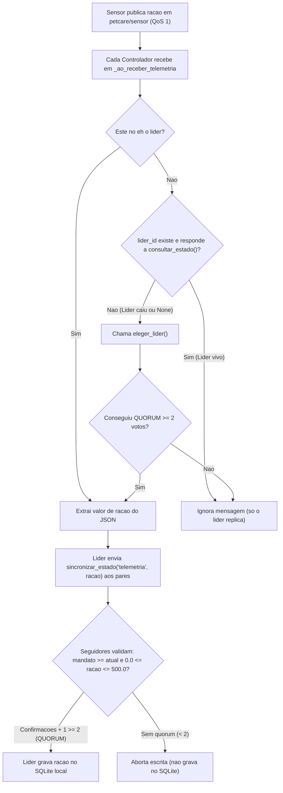
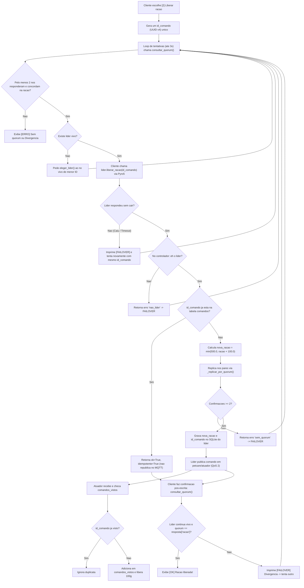

# Árvores de Decisão — Fluxo do Sistema Pet Care

## 1. Fluxo de Telemetria (Sensor -> Controladores)

```mermaid
flowchart TD
    A["Sensor publica racao em petcare/sensor (QoS 1)"] --> B["Cada Controlador recebe em _ao_receber_telemetria"]
    B --> C{"Este no eh o lider?"}
    C -- "Sim" --> G["Extrai valor de racao do JSON"]
    C -- "Nao" --> D{"lider_id existe e responde a consultar_estado()?"}
    D -- "Sim (Lider vivo)" --> E["Ignora mensagem (so o lider replica)"]
    D -- "Nao (Lider caiu ou None)" --> F["Chama eleger_lider()"]
    F --> F1{"Conseguiu QUORUM >= 2 votos?"}
    F1 -- "Nao" --> E
    F1 -- "Sim" --> G
    G --> H["Lider envia sincronizar_estado('telemetria', racao) aos pares"]
    H --> I{"Seguidores validam: mandato >= atual e 0.0 <= racao <= 500.0?"}
    I -- "Confirmacoes + 1 >= 2 (QUORUM)" --> J["Lider grava racao no SQLite local"]
    I -- "Sem quorum (< 2)" --> K["Aborta escrita (nao grava no SQLite)"]
```

---

## 2. Fluxo de Ação para o Atuador (Cliente -> Controladores -> Atuador)

```mermaid
flowchart TD
    A["Cliente escolhe [2] Liberar racao"] --> B["Gera um id_comando (UUID v4) unico"]
    B --> C["Loop de tentativas (ate 3x) chama consultar_quorum()"]
    C --> D{"Pelo menos 2 nos responderam e concordam na racao?"}
    D -- "Nao" --> E["Exibe [ERRO] Sem quorum ou Divergencia"]
    D -- "Sim" --> F{"Existe lider vivo?"}
    F -- "Nao" --> G["Pede eleger_lider() ao no vivo de menor ID"]
    G --> C
    F -- "Sim" --> H["Cliente chama lider.liberar_racao(id_comando) via Pyro5"]
    H --> I{"Lider respondeu sem cair?"}
    I -- "Nao (Caiu / Timeout)" --> J["Imprime [FAILOVER] e tenta novamente com mesmo id_comando"]
    J --> C
    I -- "Sim" --> K{"No controlador: eh o lider?"}
    K -- "Nao" --> L["Retorna erro 'nao_lider' -> FAILOVER"]
    L --> C
    K -- "Sim" --> M{"id_comando ja esta na tabela comandos?"}
    M -- "Sim" --> N["Retorna ok=True, idempotente=True (nao republica no MQTT)"]
    M -- "Nao" --> O["Calcula nova_racao = min(500.0, racao + 100.0)"]
    O --> P["Replica nos pares via _replicar_por_quorum()"]
    P --> Q{"Confirmacoes >= 2?"}
    Q -- "Nao" --> R["Retorna erro 'sem_quorum' -> FAILOVER"]
    R --> C
    Q -- "Sim" --> S["Grava nova_racao e id_comando no SQLite do lider"]
    S --> T["Lider publica comando em petcare/atuador (QoS 2)"]
    T --> U["Atuador recebe e checa comandos_vistos"]
    U --> U1{"id_comando ja visto?"}
    U1 -- "Sim" --> U2["Ignora duplicata"]
    U1 -- "Nao" --> U3["Adiciona em comandos_vistos e libera 100g"]
    T --> V["Cliente faz confirmacao pos-escrita: consultar_quorum()"]
    N --> V
    V --> W{"Lider continua vivo e quorum == resposta['racao']?"}
    W -- "Sim" --> X["Exibe [OK] Racao liberada!"]
    W -- "Nao" --> Y["Imprime [FAILOVER] Divergencia -> tenta outro"]
    Y --> C
```
